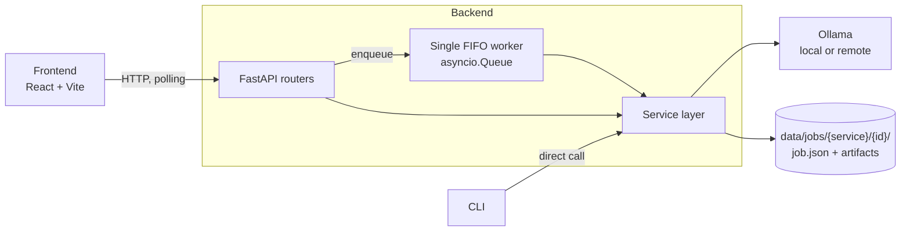

# Portfolio content for study-ai-tools

Written against the schema in `ucencode.github.io/src/data/projects.ts` — `id`, `title`,
`description`, `image`, `slides`, `projectStack`, `links`, `additionalInfo[{title, bullets}]`.
Paste section 1, capture section 3, and read section 4 before you write the card yourself.

The existing three entries (ClinicOS, BookYourGP, Pitcar) are all *closed* systems — real
outcomes, no readable source. This is the only entry where a reviewer can open the code and
check whether the claims hold. That is its whole job on the site, and section 4 is the
argument for why that beats a more advanced project they cannot read.

---

## 1. The `projects.ts` entry

Drop this after `pitcar` in the `projects` array. It uses the site's existing section
convention, with `My Role` replaced by `Design Decisions` — the project is solo, so
"my role" says nothing, and the decisions are the interesting part.

```ts
  {
    id: "study-ai-tools",
    title: "Study AI Toolkit",
    description:
      "A local-first document pipeline that turns lecture slides into structured Markdown and a curriculum into a generated textbook. Job-based backend over a local Ollama: submit, get an id, poll, read the output — with checkpointed resume, a content-addressed OCR cache, and a single-worker queue that keeps one GPU honest.",
    image: {
      src: "/projects/study-ai-tools-preview.webp",
      alt: "Study AI Toolkit job detail view",
    },
    slides: [
      { path: "slides/study-ai-tools/slide-01.webp", caption: "Job detail — named stages, live output, chapter outline" },
      { path: "slides/study-ai-tools/slide-02.webp", caption: "Jobs rail — 1 running · N waiting, the queue the backend actually has" },
      { path: "slides/study-ai-tools/slide-03.webp", caption: "Curriculum form with saved presets" },
      { path: "slides/study-ai-tools/slide-04.webp", caption: "Generated chapter — dependencies declared, Obsidian-ready Markdown" },
      { path: "slides/study-ai-tools/slide-05.webp", caption: "Architecture — the API enqueues, a single worker executes, the CLI bypasses both" },
    ],
    projectStack: [
      "Python",
      "FastAPI",
      "Pydantic",
      "asyncio",
      "Ollama",
      "Vision LLM / OCR",
      "pypdfium2",
      "React",
      "Vite",
      "Tailwind CSS",
      "pytest",
      "uv",
    ],
    additionalInfo: [
      {
        title: "Problem",
        bullets: [
          "Lecture slides and syllabi arrive as PDFs and PPTX — text trapped in images, no structure, nothing searchable or linkable in a note system.",
          "Long-running local model work is the awkward case: an OCR pass over 200 pages or a 20-chapter textbook takes far longer than a request should live, and a crash halfway through should not cost the whole run.",
          "Sending course material and personal notes to a hosted model was not something I wanted to do by default, so everything had to be able to run against a local Ollama.",
        ],
      },
      {
        title: "What I Built",
        bullets: [
          "Two pipelines on one job-based backend: slides → render → per-page OCR → refinement into Markdown, and curriculum → study plan → outline → generated textbook.",
          "A FastAPI service where submitting returns 202 and a job id; a single FIFO asyncio worker executes jobs and writes progress into job.json, which the UI polls. Uploads are streamed to disk and capped, so an oversized file is rejected while it is still arriving.",
          "Crash-resumable runs: job.json — not the files on disk — is the resume authority, so a half-written chapter from a killed process is ignored and rewritten rather than counted as done.",
          "A content-addressed OCR cache keyed on the SHA-256 of the upload plus model and dpi, so re-running a deck with different refinement settings skips the expensive pass entirely and two different files named lecture.pdf never collide.",
          "Full textbook mode makes exactly one model call per chapter: an outline stage distills the curriculum once into {topic, scope, depends_on}, and each chapter closes with a machine-read ledger of the terms it established, so the raw curriculum is never resent and the context stays flat as chapter count grows. That stage does not appear anywhere in the original design sketch — it exists because the obvious implementation resends the whole curriculum per chapter, and costs grow with chapters multiplied by curriculum size.",
          "A React + Vite + Tailwind UI on a deliberate six-dependency budget — no state library, no component library, no icon pack, and a hand-written API module — that polls instead of streaming and stops polling when a job is terminal.",
          "A CLI that calls the same service layer directly, with no HTTP and no worker in the path, so the pipelines are usable headless.",
        ],
      },
      {
        title: "Design Decisions",
        bullets: [
          "Dropped the database the plan called for. The design sketch had SQLite alongside local storage and job metadata in a separate directory from the artifacts; what shipped is one directory per job holding job.json and every file the run produced. A database would have been a second source of truth to keep in sync with the files, for one user on one machine — and keeping the record beside its artifacts is what makes delete a single rmtree, resume a matter of reading the directory, and the path-traversal check one line.",
          "Deleted the complicated version. An earlier implementation (tag legacy-web) used a JSONL event log, SSE with replay cursors, and subscriber de-duplication. It worked, and it bought resilience a single-user offline tool does not need — so it was replaced with polling a status field in a JSON file, and the reasoning is written down rather than lost.",
          "Model output is treated as an untrusted upstream, not as data. Invented and forward-referencing chapter dependencies are pruned before use, a page that fails OCR becomes [missing page N] instead of killing the run, and every saved document goes through a normalizer that repairs the LaTeX delimiters, unescaped currency, and unquoted Mermaid labels that a prompt asks for but cannot guarantee.",
          "One worker, on purpose. There is one GPU; two queues feeding it would only make every job slower while looking like throughput. The constraint is documented as an invariant and surfaced in the UI as '1 running · N waiting' rather than hidden behind a generic 'active' count.",
          "Cost is a design input. The stable prefix of every chapter prompt is byte-identical across a job so Ollama's prompt cache actually hits; breaking that silently doubles the cost of a full run, so it is an invariant with a stated reason.",
          "Every stored record is immutable after creation and validated with extra=\"forbid\", which turns schema drift into a loud failure instead of a quiet one — with the migration cost of that choice written down next to it.",
          "The architecture document is a table of invariants, each with the failure it prevents. Anything deliberately not built — job cancellation, frontend test tooling — is listed with the cost that kept it out, so the reader can tell a decision from an omission.",
        ],
      },
      {
        title: "Outcome",
        bullets: [
          "A finished, runnable tool: one setup script, one process serving both the API and the built UI, and two pipelines usable from a browser or a terminal across 21 output languages.",
          "73 tests covering both pipelines end to end, resume, the OCR cache, the conflict responses, the repository rules and presets — running in well under a second, because the model layer is stubbed at the module boundary instead of over the transport.",
          "Interrupted textbook runs resume from the next chapter rather than the first, and repeat OCR of an already-transcribed deck costs nothing.",
          "Roughly 2,800 lines of Python and 2,400 of frontend, with the reasoning for the shape of it — including what was removed and why — kept in the repository.",
        ],
      },
    ],
    links: [
      { label: "Source", url: "https://github.com/ucencode/study-ai-tools" },
      { label: "Architecture & invariants", url: "https://github.com/ucencode/study-ai-tools/blob/main/CLAUDE.md" },
    ],
  },
```

### Two edits to make it yours

- **`description`** is the card blurb and the modal subtitle. The version above is one long
  sentence; if the card looks cramped next to the other three, cut it at "read the output."
- **Title.** `study-ai-tools` is a repo name, not a project name. "Study AI Toolkit" is the
  safe choice. If you want the entry to lead with the engineering rather than the subject
  matter, "Local Study Pipeline" or "Offline Study Toolkit" both read better next to
  ClinicOS and BookYourGP.

---

## 2. Shorter copy, for the places the modal does not reach

**One line (README badge, GitHub About, link preview):**
> Local-first job pipeline that turns slides into structured Markdown and a curriculum into a
> generated textbook, on your own Ollama.

**CV bullet — put it under a Projects section, not under work experience:**
> **Study AI Toolkit** (Python, FastAPI, React) — Local-first document pipeline over Ollama.
> Job-based backend with a single-worker FIFO queue, checkpointed resume from `job.json`,
> and a SHA-256-keyed OCR cache; textbook generation makes exactly one model call per chapter
> by distilling dependencies once up front. 73 tests, sub-second suite with the model layer
> stubbed.

**LinkedIn post, if you want one:**
> I rewrote a side project by deleting its most impressive part.
>
> The first version streamed job progress over SSE, backed by a JSONL event log with replay
> cursors so a reconnecting client could catch up exactly. Correct, and genuinely nice to
> build.
>
> It is a single-user offline tool. Nobody reconnects. There is no second client. I replaced
> the whole thing with a status field in a JSON file that the UI polls every three seconds,
> and the app got better — fewer moving parts, one obvious code path, and a failure mode that
> is "the poll returns stale data" instead of "the replay cursor is off by one."
>
> The old implementation is still there under a git tag, and the reason it left is written
> down in the architecture doc. Being able to explain why the boring version won is worth
> more to me than the SSE code was.
>
> https://github.com/ucencode/study-ai-tools

---

## 3. Screenshots to capture

The site's modal is a carousel — four slides is the right length, and the entry above
already names them. Run `uv run fastapi dev` with a real job finished, then capture:

| Slide | Shot | Why this one |
|---|---|---|
| 01 | Job detail on a running full-mode curriculum job — stage checklist, chapter outline with dependency chips, output growing | The single strongest frame. It shows a queue, named stages, and real partial output; it is the screenshot that says "backend" rather than "chatbot". |
| 02 | Jobs rail with one running and two or three waiting | Makes the single-worker queue visible without a paragraph of explanation. |
| 03 | Curriculum form with the preset bar and a saved preset applied | Shows there is a product here, not just an endpoint. |
| 04 | A generated chapter rendered in Obsidian, with maths and a Mermaid diagram displaying correctly | The payoff, and quiet proof the normalizer does something. Obsidian's own chrome also makes it obvious the output is a real file, not a text box. |
| 05 | The shipped architecture diagram from section 5, rendered | Optional fifth slide. Worth including because it is the one frame that shows the API not running the work — the queue and the CLI bypass are both visible in it. |

Take them in **dark mode** — the other three previews on your site are product screenshots
with light chrome, so this one will read as distinct rather than as a fourth dashboard.
Export `.webp` to match, and use slide 01 as `study-ai-tools-preview.webp`.

---

## 4. Why this belongs on the site, next to more advanced AI projects

You already know other people's AI projects are more advanced. That is the wrong axis. A
portfolio entry is evidence, and the question a reviewer is actually answering is *what can
I verify about how this person builds things*. Measured that way, this project is stronger
than most of what it will sit next to.

**1. It is a backend infrastructure project wearing an AI costume — and you are applying for
backend roles.** Strip the LLM out and what remains is a job queue, a status machine,
crash-resume semantics, a content-addressed cache, immutable records with strict validation,
streamed uploads with a size cap, path-traversal containment, and correct 409s on operations
that are unsafe while a job is live. That list is the job description. A polished RAG demo
demonstrates that someone can wire four libraries together in the order a tutorial specified;
it produces almost no evidence about queueing, resumption, or failure handling, because the
framework made all of those decisions.

**2. It is the only entry a reviewer can actually read.** ClinicOS, BookYourGP and Pitcar are
your real work and carry the real outcomes — but they are closed, and everything a reader
learns about them, they learn from your own summary. Here they can open `CLAUDE.md`, read a
table of invariants each stating the failure it prevents, then open the code and check. That
transition — from "he says he cares about correctness" to "I watched him state a rule and
enforce it" — is the single most valuable thing a public repository can do for a portfolio,
and advanced projects built out of other people's abstractions cannot do it.

**3. You removed your own working code, and documented why.** The `legacy-web` tag holds an
SSE + event-log implementation that was rejected as too complicated for a single-user offline
tool. Nearly every portfolio project is a record of additions only. Deleting something that
worked because it bought resilience the project did not need is a senior judgement signal,
and it is rare enough in a public repo that it is worth leading with in an interview. The
same instinct shows up in the six-dependency frontend budget and in a TODO file with a
"Not planned" section that gives costs rather than excuses.

**4. Non-determinism is the genuinely hard part of LLM work, and this handles it as an
integration problem.** Models emit invented dependencies, forward references, `\(x\)` where
Obsidian needs `$x$`, unquoted Mermaid labels that silently render as nothing, and pages that
simply fail. Every one of those is defended: pruned, normalized, or degraded to
`[missing page N]` so one bad page does not cost a 200-page run. This is exactly the shape of
the work in your ClinicOS bullets — external lab and insurance systems that return whatever
they return — applied to a flakier upstream. It is the same competence, demonstrable in
public.

**5. It shows cost thinking without a bill to force it.** One model call per chapter, a
prompt prefix held byte-identical so the cache hits, an OCR cache keyed on content rather
than filename. Most people only learn to think this way after an invoice teaches them. Doing
it on hardware where the cost is only your own time is a better signal than doing it after
being told to.

**6. It is finished.** `setup.sh` on a clean machine, one process serving API and UI, 73 tests
in under a second, a CLI, a README that matches the code. The most common failure of a
portfolio project is that it half-works and the reviewer stops. Complete and modest beats
ambitious and abandoned, every time.

**7. The design plan still exists, and it disagrees with the code.** Section 5 lays out where.
Most projects either have no plan or quietly rewrite it to match what got built; keeping the
original means a reviewer can see a design meet reality and lose specific arguments for stated
reasons — a database that earned nothing, a stage that was doing a second pass over its own
output, and one stage the plan never imagined because a flowchart does not show what a box
costs to run. "I can design a system" is a claim everyone makes. "Here is my design, here is
what shipped, here is why they differ" is the same claim with evidence attached.

**8. It is a second stack, chosen and not assigned.** Your paid work is Node/TypeScript/PHP.
This is Python, FastAPI, Pydantic, asyncio and React, done to the same standard. That reads
as "engineer" rather than "Node engineer", which widens the roles you can credibly apply for.

### If someone calls it a toy

Agree, and re-aim. "Toy" describes scope, not quality — one user, one machine, no auth, no
multi-tenancy. That constraint is stated up front and the design follows from it honestly,
which is the opposite of a project that pretends to be distributed. The reply that lands:
*"It's small on purpose. Every non-obvious thing in it has a written reason, and one of those
reasons is why I deleted the impressive version. Happy to walk you through either."*

### What not to claim

Do not call this production, do not claim users, do not invent a percentage. The other three
entries carry your real metrics — 25% build time, 60–75% load times, 400+ service units — and
this one's credibility comes from being verifiable instead. A fabricated number here would
put the real ones in doubt.

---

## 5. The plan, and what shipped

The original design sketch — two pipeline flowcharts, an architecture diagram and a job
lifecycle diagram — is worth keeping, and worth showing **next to** the built system rather
than instead of it. A plan on its own says you can draw boxes. A plan beside the shipped
version, with the differences explained, says you can hold a design loosely and change it
for a reason. Very few portfolio projects can show that, because very few keep the plan.

Put the diagrams in the repository README under an "Architecture" heading (the modal already
links there), and export the shipped architecture diagram as a fifth carousel slide. Two
caveats before you reuse the originals:

- The architecture diagram declares `Storage[(Local Storage)]` and then never uses it, while
  `Service --> SQLite` silently creates an undeclared node. Mermaid renders it without
  complaint, which is exactly the failure mode the project's own normalizer exists to catch.
- It shows SQLite. There is no database in the shipped system, so publishing it unchanged
  would misdescribe the project. Redraw it, or publish it as the plan with the delta table
  below underneath.

### The shipped architecture



The one structural difference from the sketch: the API does not run the work. It validates,
writes the record, enqueues, and returns `202`. The worker is the only thing that executes a
job, and the CLI bypasses both — same service layer, no HTTP and no queue in the path.

### What changed, and why

| Planned | Shipped | Why it changed |
|---|---|---|
| `Service --> SQLite`, plus local storage | No database. `job.json` in the job's own directory is the only store. | One user, one process. A database would have been a second source of truth to keep in sync with files that must exist anyway. The honest cost: listing jobs is a directory scan and there is no query layer — fine at this scale, and the first thing to change if it stopped being. |
| Metadata in `_jobs_/job_[id].json`, artifacts in `[job-type]/[prefix]_[id].[ext]` | One directory per job holding `job.json` and everything the run produced | Two parallel locations means two things to keep consistent and two ways to leak. Co-locating makes delete a single `rmtree`, makes resume a matter of reading the directory, and lets stored paths be relative — which is what reduces the path-traversal check to one line. |
| Job-id prefixes (`ocr-summary`, `study-plan`) to tell types apart | Service is a directory level; ids are `YYYYMMDDHHMMSS-xxxx` | The same information without parsing strings. A sortable id makes "newest first" a sort rather than a query — which matters more once there is no database to sort for you. |
| Slides: OCR → refine → pick language → pick level → **generate summary** (two model passes) | Three stages: `convert → ocr → refine`, with one `action` (`skip`/`clean`/`summary`/`deep`) deciding what the refine pass does; `level` applies only to `summary` and `deep` | The second pass was re-reading text the first pass had just written. Collapsing them removed a full pass over the whole document and one more stage that could fail mid-run. |
| Curriculum: metadata → structure → gather context → custom context → quiz → mode | `metadata → plan → outline → (material + references \| chapters)` | The **outline** stage is not in the plan at all, and it is the most important part of the system. See below. |
| Quiz drawn inline in the pipeline | A separate pre-submit endpoint; answers are stored in `params` and travel with the job | A queued job runs unattended. Anything that needs a human has to happen before submit, or the single worker blocks on a person who has closed the tab. |
| "Include General Knowledge from LLM" for the full textbook | One model call per chapter, chained through declared dependencies and a flat `established` ledger | The plan said what to generate. It did not model what generating it would cost. |

### The stage the plan missed

Worth telling on its own, because it is the difference between a diagram and a system.

The obvious full-mode implementation sends the curriculum with every chapter request. Cost
grows as chapters × curriculum size, and each chapter has to *guess* what earlier chapters
already covered — so adjacent ones drift together and repeat each other. The fix was a stage
that isn't in the sketch: distill the curriculum **once** into `{topic, scope, depends_on}`
per chapter, so the raw text is never resent; decide every dependency at that point, with all
topics visible, so a chapter is *told* whether a link exists instead of inventing one; and
have each chapter return a one-line ledger of terms it established, which keeps the carried
context flat instead of growing with chapter count. Then prune the dependencies the model
invents or points forward at, because it does both.

None of that is visible from the flowchart. It only appears once you ask what the boxes cost
to run — which is the honest reason the plan and the build differ, and a better answer to
"how do you approach design" than either document alone.

---

## 6. Three interview stories, ready to tell

Each is a decision with a reason, which is the form these questions are really asking for.

**"Tell me about a technical decision you'd defend."** The SSE removal. Event log, replay
cursors, subscriber index de-duplication — all correct, all serving a reconnecting-client
problem that does not exist for one user on one machine. Replaced with polling a status field.
The interesting half is the cost that justified it: the failure mode went from an off-by-one
in a replay cursor to "the poll shows data three seconds old", and the code that can go wrong
shrank to almost nothing. Point at the tag; the old version is still readable.

**"How do you handle unreliable dependencies?"** Same answer shape as the lab and insurance
integrations at ClinicOS, but the upstream here is a model, so it fails creatively rather than
predictably. Three defences: prune what it invents (dependency pruning drops forward and
non-existent topics), repair what it formats wrong (the normalizer, because a prompt is a
request and not a guarantee), and degrade what fails rather than aborting (`[missing page N]`,
so page 74 does not cost pages 1–73). Then the resume rule that makes the whole thing safe:
`job.json` is the authority, never the files on disk, because a half-written file must never
look complete.

**"How do you test something that talks to a model?"** Stub at the module boundary — the five
functions in `app.core.llm` — not at the HTTP transport. Mocking the transport means testing
the Ollama client, which is someone else's code. Stubbing the boundary means the tests are
about your pipeline, and the suite runs in under a second with no models installed, which is
what makes 73 tests worth keeping. Worth pairing with the fixture that exists purely because
the OCR cache scans completed jobs: without wiping the jobs directory between tests, a
leftover would turn the next test's OCR into a silent no-op and quietly invalidate it.

**"What did you get wrong in the design?"** — the one worth volunteering, because you have the
plan to show. Two things. The storage layer: the sketch had SQLite and split job metadata away
from the artifacts, and both went. There was nothing a database was going to do for one user
that a file in the job's own directory did not, and separating the record from the files it
describes only creates a pair to keep in sync. Say the cost out loud too — listing jobs is now
a directory scan with no query layer, which is fine at this scale and is the first thing that
would change if it stopped being. The second is more interesting because it is an omission
rather than a mistake: the plan has no outline stage, because a flowchart does not show what a
box costs to run. It only appeared once the obvious implementation turned out to grow as
chapters × curriculum size. Design survives contact or it doesn't; keeping the plan around is
how you can tell which.

---

## 7. Known limitations, and how to say them

State these before you are asked. Each is a documented decision in the repository, which is
the point — the ability to name a limitation and its cost is what separates a decision from
an oversight.

| Limitation | How to frame it |
|---|---|
| No authentication or multi-tenancy | Single-user offline tool by design. Adding auth would be the first change if it were ever shared, and nothing in the layering resists it — the routers already do nothing but validate and delegate. |
| One worker, no configurable concurrency | One GPU. Parallel jobs would contend, not scale. It is on the TODO as a limiter — job concurrency separated from LLM-call concurrency — rather than as a worker count, because raising uvicorn workers creates two queues feeding one device. |
| No frontend tests | A test runner would have doubled a six-dependency budget for a UI this size. Behaviour was verified with throwaway Playwright scripts. Listed under "Not planned" with the condition that would change it. |
| No job cancellation | Deleting files under a live worker corrupts state; safe cancellation needs cooperative checkpoints in every stage. Jobs are short and the queue is shallow, so waiting is cheaper than the machinery. Revisit when that stops being true. |
| No streaming to the client | Deliberate — see the SSE story above. |
